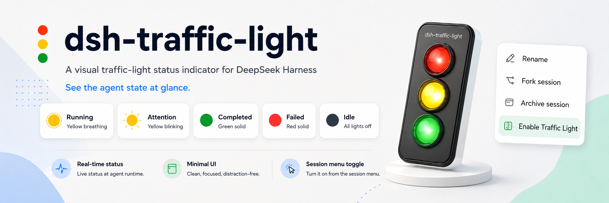
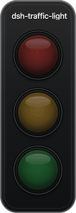

<p align="center">
  
</p>
<p align="center">
  <strong>给 DeepSeek Harness 每个 Session 一个桌面红绿灯</strong>
</p>
<p align="center">
  <strong>中文</strong> · <a href="README.en.md">English</a>
</p>
<p align="center">
  <a href="https://www.npmjs.com/package/dsh-traffic-light"></a>
  <a href="LICENSE"></a>
  
</p>


# dsh-traffic-light

> 不用一直盯着 DSH 页面。每个开启监控的 Session 都会在桌面显示一个独立的悬浮灯，运行、等待、完成和失败一眼可见。

## 它能做什么

- 一个 Session 对应一个悬浮灯，多个 Session 可以同时显示。
- 悬浮灯独立置顶、可拖动，不占用 DSH 页面空间。
- 从 Session 的三点菜单单独开启或关闭，不会影响同一工作区的其他 Session。
- 右键悬浮灯后选择「关闭悬浮灯」，关闭动作会同步回 DSH 页面。
- 运行状态只在本机显示，不上传 Session 内容。

## 界面预览

<p align="center">
  
</p>

> 动图依次演示：空闲 → 运行中 → 需要关注 → 已完成 → 失败。黄色慢呼吸表示运行中，黄色快闪表示需要关注。

## 安装

在终端执行：

```sh
dsh plugin --profile web add dsh-traffic-light
```

如果当前 DSH 已经使用 `web` profile，也可以简写为：

```sh
dsh plugin add dsh-traffic-light
```

安装完成后重启 DSH Web：

```sh
dsh web
```

首次安装会下载桌面悬浮窗所需的运行组件，请等待安装完成。

## 使用方式

1. 在 DSH 中打开要监控的 Session。
2. 点击该 Session 的三点菜单。
3. 选择「开启红绿灯」。
4. 桌面会出现该 Session 对应的悬浮灯。
5. 对其他 Session 重复以上步骤，即可同时监控多个 Session。

关闭单个悬浮灯有两种方式：

- 在对应 Session 的三点菜单中选择「关闭红绿灯」；
- 在悬浮灯上右键，然后选择「关闭悬浮灯」。

关闭一个 Session 不会关闭其他 Session 的悬浮灯。

## 灯光含义

悬浮窗只有红、黄、绿三种实体灯。黄色通过亮度和闪烁速度区分两种状态：

| 灯光表现 | 页面状态 | 含义 |
| --- | --- | --- |
| 黄灯慢慢呼吸 | Running（运行中） | Session 正在执行任务。 |
| 黄灯快速闪烁 | Attention（需要关注） | 正在等待你的确认、回答，或任务暂时受阻。 |
| 绿灯常亮 | Completed（已完成） | 本轮任务已正常完成。 |
| 红灯常亮 | Failed（失败） | 本轮任务发生错误或异常中断。 |
| 三灯熄灭 | Idle（空闲） | 当前没有正在执行的任务。 |

完成后的绿灯会短暂保留，方便你注意到刚刚完成的任务；开始下一轮任务后会恢复为运行状态。

## 多 Session 的显示规则

悬浮灯按 Session 保存开关状态，而不是按工作区保存。也就是说：

- 同一工作区中的多个 Session 可以只开启其中一部分；
- 不同工作区中的 Session 也可以同时开启；
- 每个悬浮灯只反映它对应的 Session，不会把其他 Session 的状态混在一起；
- 关闭某个悬浮灯不会影响其他悬浮灯。

## 常见问题

### Session 菜单里没有「开启红绿灯」

确认插件安装到了 `web` profile，然后完全退出并重新启动 `dsh web`。如果 DSH 正在运行，安装后只刷新浏览器页面可能不会加载插件菜单。

### 点击开启后没有窗口

首次启动可能需要几秒完成桌面运行组件的准备。仍未出现时，关闭当前 DSH Web 后重新执行 `dsh web`，再从 Session 菜单开启一次。

### 关闭悬浮灯后，菜单仍显示开启

先等待片刻让 DSH 页面同步；如果页面没有变化，刷新 DSH 页面或重启 `dsh web`。重新打开菜单时，开关状态会以当前 Session 的实际悬浮灯状态为准。

### 多个悬浮灯位置重叠

把悬浮灯拖到需要的位置即可。每个 Session 都有独立窗口，重新开启后仍可继续调整布局。

### 状态没有变化

确认对应 Session 仍在运行，并检查 DSH Web 是否保持打开。状态来自 DSH 当前运行情况，不会读取其他应用或终端中的任务。

## 卸载

```sh
dsh plugin --profile web remove dsh-traffic-light
```

卸载后重启 DSH Web。已打开的悬浮灯会随插件退出而关闭。

## 兼容性与隐私

- 需要已安装 DeepSeek Harness，并使用 Web profile。
- 当前主要在 macOS 上验证；Windows 和 Linux 可以尝试使用，若桌面环境限制透明置顶窗口，显示效果可能不同。
- 插件只在本机 DSH 与桌面窗口之间传递状态，不上传 Session 内容、提示词或工具结果。
- 首次安装需要下载 Electron 运行组件，因此安装包会比普通网页插件更大。

## 文档

- [快速开始](docs/getting-started.md)：从安装到第一次开启悬浮灯。
- [使用设置](docs/configuration.md)：按 Session 管理开关、窗口和状态保留规则。
- [状态说明](docs/architecture.md)：用通俗方式解释五种页面状态如何映射到三盏灯。

## License

[MIT](LICENSE)
